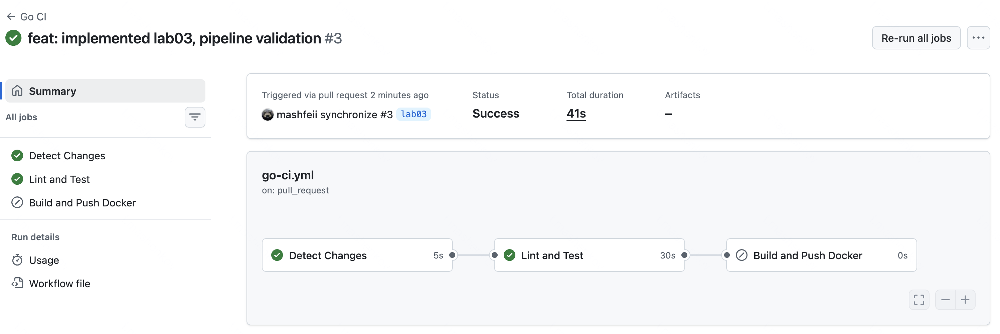
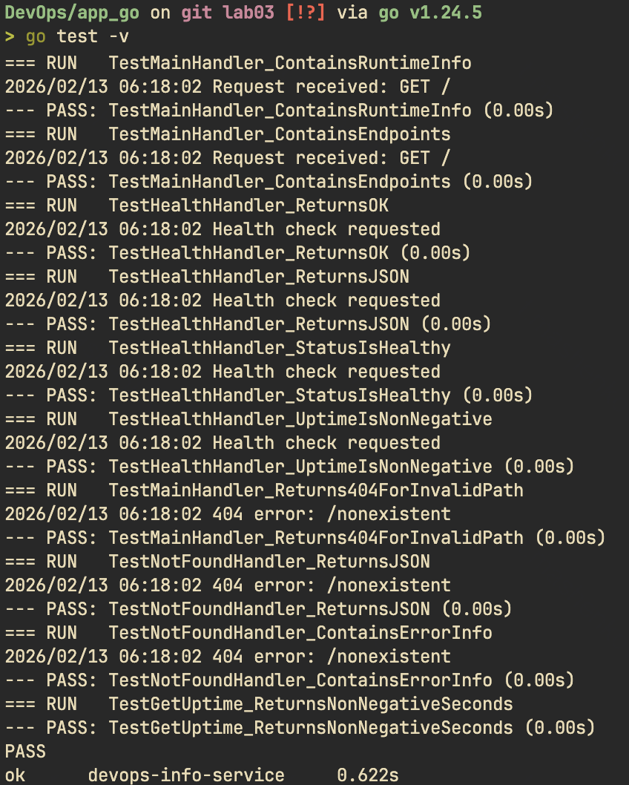

# Lab 03 - CI/CD with GitHub Actions (Go Bonus)

## Overview

This document covers the Go CI workflow implementation as part of the Lab 03 bonus task for multi-app CI with path filters.

### Testing Framework: Go Standard Library

**Why Go's built-in testing:**

- **Zero dependencies**: Part of Go standard library (`testing` package)
- **Convention-based**: Files ending in `_test.go` are automatically tests
- **Built-in coverage**: `go test -cover` works out of the box
- **Fast execution**: Compiled tests run extremely fast

### Endpoints Tested

| Endpoint      | Tests Count | What's Validated                                                       |
| ------------- | ----------- | ---------------------------------------------------------------------- |
| `GET /`       | 6 tests     | Status code, JSON content-type, service/system/runtime info, endpoints |
| `GET /health` | 4 tests     | Status code, JSON format, health status, uptime                        |
| 404 handler   | 3 tests     | Status code, error format, path inclusion                              |
| Helper        | 1 test      | getUptime() returns valid values                                       |

**Total: 14 tests** covering all handlers and helper functions.

### Workflow Triggers

```yaml
on:
  push:
    branches: [main, master]
    paths:
      - 'app_go/**'
      - '.github/workflows/go-ci.yml'
  pull_request:
    branches: [main, master]
    paths:
      - 'app_go/**'
      - '.github/workflows/go-ci.yml'
```

**Path filters ensure:**

- Go CI only runs when Go code changes
- Python CI only runs when Python code changes
- Both can run in parallel if both change

---

## Workflow Evidence

### 1. Go CI Workflow Run



---

### 2. Go Tests Passing Locally



---

### 3. Go Coverage Report


**Coverage breakdown:**

- `getUptime`: 100%
- `mainHandler`: 100%
- `healthHandler`: 100%
- `notFoundHandler`: 100%
- `main`: 0% (entry point, expected)
- **Total: ~68%**

---

### 4. Path Filters Working


---

### 5. Docker Hub Go Images


**Docker Hub URL:** https://hub.docker.com/r/mashfeii/devops-info-service-go

---

## CI Workflow Comparison

| Aspect               | Python CI                    | Go CI                           |
| -------------------- | ---------------------------- | ------------------------------- |
| **Language Setup**   | actions/setup-python@v5      | actions/setup-go@v5             |
| **Linting**          | ruff check                   | golangci-lint-action            |
| **Testing**          | pytest                       | go test                         |
| **Coverage Tool**    | pytest-cov                   | go test -coverprofile           |
| **Coverage Upload**  | codecov-action (xml)         | codecov-action (out)            |
| **Docker Image**     | mashfeii/devops-info-service | mashfeii/devops-info-service-go |
| **Final Image Size** | ~150MB (python:3.13-slim)    | ~6MB (scratch)                  |

---

## Benefits of Path-Based Triggers

1. **Resource efficiency**: Only relevant CI runs, saving compute time
2. **Faster feedback**: Don't wait for unrelated tests
3. **Clear ownership**: Each app has its own CI configuration
4. **Independent deployment**: Can deploy Python without touching Go

---

## Challenges

### Challenge: golangci-lint Configuration

**Problem:** golangci-lint flagged some style issues in auto-generated code.

**Solution:** Either fix the issues or configure `.golangci.yml` to exclude specific checks.

### Challenge: Coverage File Format

**Problem:** Go coverage output is `.out` format, not `.xml`.

**Solution:** Codecov supports Go coverage format natively:

```yaml
files: app_go/coverage.out
flags: go
```
