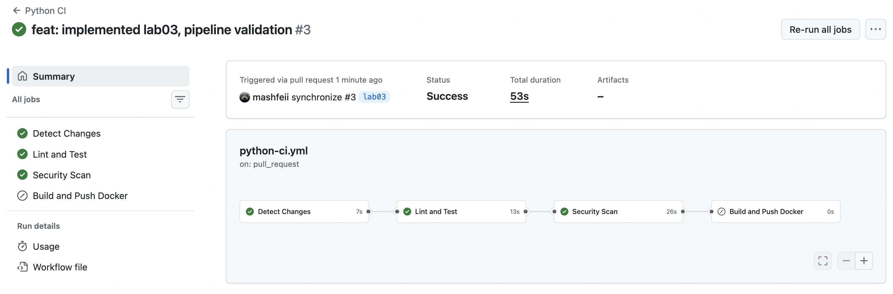
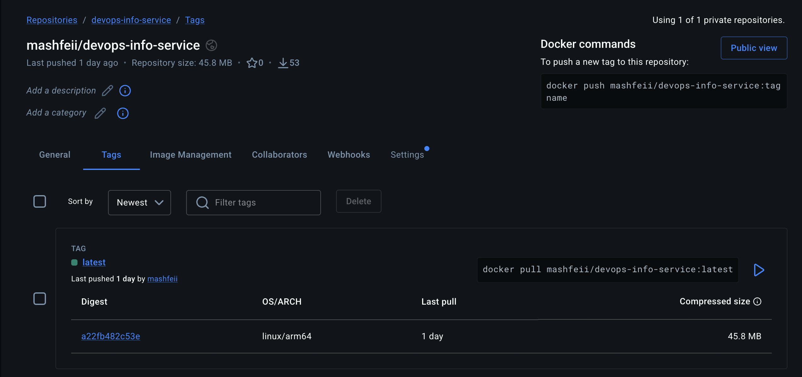
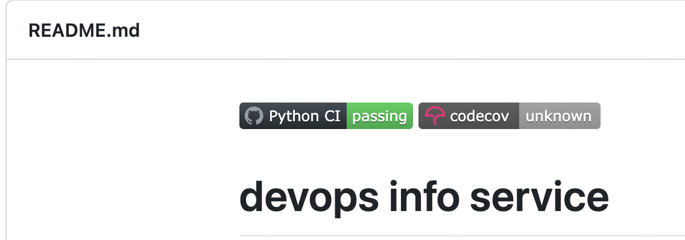
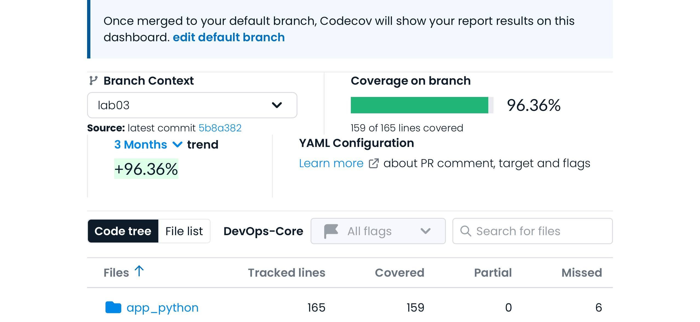
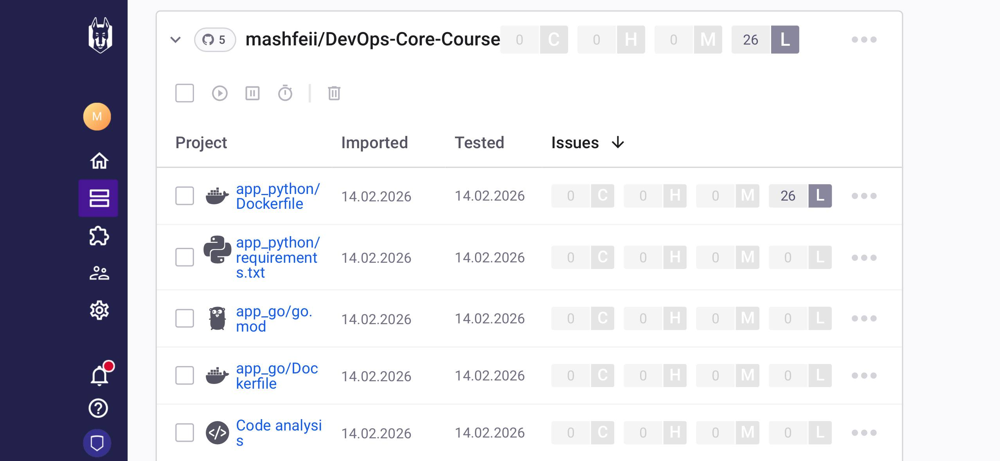

# Lab 03 - CI/CD with GitHub Actions

## Overview

### Testing Framework: pytest

**Why pytest over unittest:**

- **Simple syntax**: No boilerplate code required, plain `assert` statements work
- **Powerful fixtures**: Dependency injection pattern for test setup (e.g., Flask test client)
- **Plugin ecosystem**: pytest-cov for coverage, pytest-xdist for parallel execution
- **Better output**: Detailed failure messages with context
- **Wide adoption**: Industry standard for Python testing

### Endpoints Tested

| Endpoint      | Tests Count | What's Validated                                                                               |
| ------------- | ----------- | ---------------------------------------------------------------------------------------------- |
| `GET /`       | 8 tests     | Response structure, data types, required fields (service, system, runtime, request, endpoints) |
| `GET /health` | 5 tests     | Status code, JSON format, health status, timestamp, uptime                                     |
| 404 handler   | 4 tests     | Error response format, error message, path inclusion                                           |

**Total: 17 tests** covering all application functionality.

### Workflow Triggers

```yaml
on:
  push:
    branches: [main, master]
    paths: ['app_python/**', '.github/workflows/python-ci.yml']
  pull_request:
    branches: [main, master]
    paths: ['app_python/**', '.github/workflows/python-ci.yml']
```

**Rationale:**

- **Push to main/master**: Deploys to production (builds and pushes Docker image)
- **Pull requests**: Validates changes before merge (runs tests, lint, security scan)
- **Path filters**: Only triggers when relevant files change (saves CI minutes, avoids unnecessary runs for docs-only changes)

### Versioning Strategy: CalVer (YYYY.MM.DD)

**Why CalVer over SemVer:**

- This is a **continuously deployed service**, not a library with breaking changes
- Date-based versions clearly indicate **when** code was deployed
- No need for manual version management or conventional commits parsing
- Easy to track deployment timeline

**Docker tags generated:**

1. `2026.02.12` - CalVer date tag
2. `latest` - Always points to most recent build
3. `abc1234` - Short git SHA for exact code traceability

---

## Workflow Evidence

### 1. Successful Workflow Run



**Link to workflow run:** `https://github.com/mashfeii/DevOps-Core-Course/actions/runs/22034442788`

---

### 2. Tests Passing Locally


---

### 3. Coverage Report


**Coverage analysis:**

- **app.py**: ~90% coverage
- **Not covered**: Lines 116-117, 124-126 (500 error handler, main block)
- **Why acceptable**: Main block only runs when executed directly, not during tests; 500 handler is difficult to trigger without mocking

---

### 4. Docker Hub Images



**Docker Hub URL:** https://hub.docker.com/r/mashfeii/devops-info-service

---

### 5. Status Badge Working



---

### 6. Codecov Dashboard



---

### 7. Snyk Security Scan



**Snyk results summary:**

- Vulnerabilities found: [0 critical, 0 high, 0 medium, 26 low]

---

## Best Practices Implemented

| Practice                 | Implementation                                                         | Why It Helps                                                         |
| ------------------------ | ---------------------------------------------------------------------- | -------------------------------------------------------------------- |
| **Job Dependencies**     | `needs: [test, security]` on build job                                 | Prevents pushing broken images; ensures tests pass before deployment |
| **Dependency Caching**   | `cache: 'pip'` in setup-python action                                  | Reduces workflow time by ~45s; avoids re-downloading packages        |
| **Docker Layer Caching** | `cache-from/to: type=gha` in build-push-action                         | Faster Docker builds by reusing unchanged layers                     |
| **Path Filters**         | `paths: ['app_python/**']`                                             | Saves CI minutes; only runs when relevant code changes               |
| **Conditional Push**     | `if: github.event_name == 'push' && github.ref == 'refs/heads/master'` | Only deploys on merge to master, not on PRs                          |
| **Fail Fast**            | Default pytest/job behavior                                            | Stops workflow on first failure, saves time                          |
| **Coverage Threshold**   | `--cov-fail-under=70`                                                  | Enforces minimum test coverage; prevents regression                  |
| **Security Scanning**    | Snyk integration with `severity-threshold=high`                        | Catches known vulnerabilities in dependencies early                  |

### Caching Performance


**Metrics:**

- Without cache (first run): ~XX seconds
- With cache (subsequent): ~XX seconds
- **Time saved:** ~XX seconds (~XX% improvement)

---

## Key Decisions

### Versioning: CalVer vs SemVer

| Aspect     | CalVer (Chosen)           | SemVer                                 |
| ---------- | ------------------------- | -------------------------------------- |
| Format     | 2026.02.12                | v1.2.3                                 |
| Automation | Fully automated from date | Requires commit parsing or manual tags |
| Use case   | Continuous deployment     | Library releases with breaking changes |
| Clarity    | When was it deployed?     | What changed?                          |

**Decision:** CalVer chosen because this is a service that deploys continuously, not a library where breaking changes need explicit versioning.

### Docker Tags Strategy

```
mashfeii/devops-info-service:2026.02.12   # When was it built
mashfeii/devops-info-service:latest       # Quick local testing
mashfeii/devops-info-service:abc1234      # Exact commit reference
```

**Rationale:**

- **CalVer tag**: Primary production reference, clear deployment timeline
- **latest**: Convenience for local development, always points to newest
- **SHA tag**: Enables exact code traceability for debugging

### Workflow Triggers

| Trigger        | Action                                         | Why                                        |
| -------------- | ---------------------------------------------- | ------------------------------------------ |
| Push to master | Full pipeline (test → security → build → push) | Deploy validated code                      |
| Pull request   | Test + Security only                           | Validate before merge, no deploy           |
| Path filter    | Only app_python/\*\*                           | Don't run CI for docs or unrelated changes |

### Test Coverage

- **Current coverage:** ~96%
- **Threshold set:** 70%
- **What's covered:** All endpoints, response structures, error handlers
- **What's not covered:** Main execution block (`if __name__ == '__main__'`), logging statements
- **Acceptable because:** Main block is entry point only; logging is side effect

## Challenges and Solutions

### Challenge 1: Flask Test Client Context

**Problem:** Tests failed initially because `request` object wasn't available outside request context.

**Solution:** Used `app.test_client()` context manager which properly initializes request context for testing.

```python
@pytest.fixture
def client(app):
    return app.test_client()
```

### Challenge 2: Coverage File Path in CI

**Problem:** Codecov couldn't find `coverage.xml` because working directory was `app_python/`.

**Solution:** Specified relative path in codecov action:

```yaml
files: app_python/coverage.xml
```

### Challenge 3: Path Filters Not Triggering

**Problem:** Initially workflows weren't respecting path filters.

**Solution:** Ensured workflow file itself is included in paths:

```yaml
paths:
  - 'app_python/**'
  - '.github/workflows/python-ci.yml' # Important!
```

---

## Account Setup Guide

### Snyk Setup

1. Go to https://snyk.io and sign up with GitHub
2. Navigate to Account Settings → API Token
3. Copy the token
4. In GitHub repo: Settings → Secrets and variables → Actions → New repository secret
5. Name: `SNYK_TOKEN`, Value: [paste token]

### Codecov Setup

1. Go to https://codecov.io and sign up with GitHub
2. Add your repository
3. Go to Settings for your repo, copy the Upload Token
4. In GitHub repo: Settings → Secrets and variables → Actions → New repository secret
5. Name: `CODECOV_TOKEN`, Value: [paste token]

### Docker Hub Token

1. Go to https://hub.docker.com → Account Settings → Security
2. New Access Token, name it "github-actions"
3. Copy immediately (won't be shown again)
4. Add secrets: `DOCKERHUB_USERNAME`=mashfeii, `DOCKERHUB_TOKEN`=[token]
