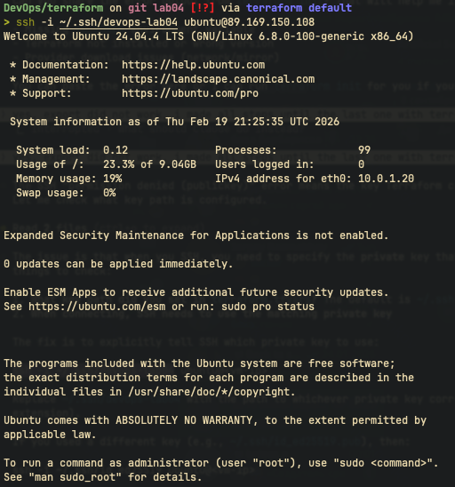
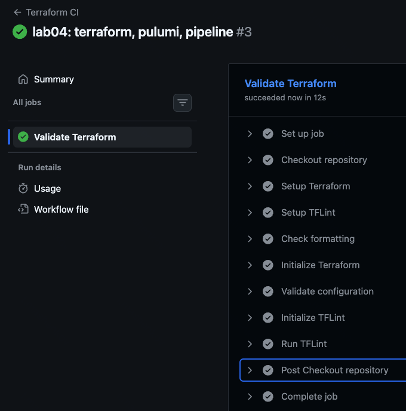
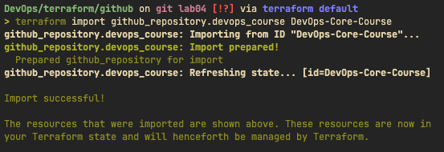

# Lab 04 - Infrastructure as Code

## Overview

- Provisioning cloud infrastructure using two IaC tools: Terraform and Pulumi
- Deploying a virtual machine on Yandex Cloud with networking and security
- Comparing declarative (HCL) and imperative (Python) approaches to IaC
- Bonus: CI/CD validation pipeline for Terraform and GitHub repository import

## Cloud Provider Selection

### Yandex Cloud

- Free tier with initial credits for new accounts
- Native Terraform provider (`yandex-cloud/yandex`) with active maintenance
- Pulumi community provider available (`pulumi-yandex`)
- Geographic accessibility and straightforward account setup

### Resources Created

| Resource         | Specification                                         |
| ---------------- | ----------------------------------------------------- |
| Compute Instance | standard-v2, 2 cores (20% fraction), 1 GB RAM         |
| Boot Disk        | 10 GB HDD, Ubuntu 24.04 LTS                           |
| VPC Network      | `devops-network` with project labels                  |
| Subnet           | `devops-subnet`, CIDR 10.0.1.0/24, zone ru-central1-a |
| Security Group   | SSH (22), HTTP (80), App (5000) ingress; all egress   |

## Terraform Implementation

### Project Structure

```
terraform/
  .gitignore
  .tflint.hcl
  main.tf
  outputs.tf
  variables.tf
  github/
    .gitignore
    main.tf
    outputs.tf
```

### Key Configuration Decisions

- **Provider authentication**: via environment variables (`YC_TOKEN`, `YC_CLOUD_ID`) rather than hardcoded credentials, keeping the configuration portable and secure
- **Dynamic image lookup**: using `data "yandex_compute_image"` with `family = "ubuntu-2404-lts"` to always get the latest image in the family
- **Resource labeling**: all resources tagged with `project = "devops-course"` and `lab = "lab04"` for cost tracking and organization
- **Variable separation**: all configurable values extracted to `variables.tf` with sensible defaults, only `folder_id` is required
- **Security group**: explicit ingress rules for SSH, HTTP, and application ports with full egress allowed

### Terraform Commands Output

#### terraform init


#### terraform plan


#### terraform apply


#### SSH Connection Proof



## Pulumi Implementation

### Project Structure

```
pulumi/
  .gitignore
  Pulumi.yaml
  requirements.txt
  __main__.py
```

### Key Differences from Terraform

- **Configuration via Pulumi Config**: uses `pulumi.Config()` with `require()` and `get()` instead of `.tfvars` files
- **SSH key as value**: the public key content is passed directly via config rather than a file path, since Pulumi config supports secret values natively
- **Python native constructs**: conditionals, string formatting, and type hints available directly without HCL workarounds
- **Typed argument classes**: uses `*Args` dataclasses (e.g., `ComputeInstanceResourcesArgs`) for structured, IDE-friendly resource configuration
- **Output transformations**: uses `.apply()` for computed value transformations (e.g., building the SSH command from the IP)

### Pulumi Commands Output

#### pulumi preview


#### pulumi up


#### SSH Connection Proof


## Terraform vs Pulumi Comparison

| Aspect           | Terraform                                       | Pulumi                                       |
| ---------------- | ----------------------------------------------- | -------------------------------------------- |
| Language         | HCL (domain-specific)                           | Python, Go, TypeScript, etc                  |
| Learning Curve   | Low for simple cases, steeper for complex logic | Depends on language familiarity              |
| IDE Support      | HCL plugins, limited autocomplete               | Full language IDE support                    |
| State Management | Local file or remote backends                   | Pulumi Cloud or self-managed backends        |
| Debugging        | `terraform console`, plan output                | Standard language debuggers (pdb, etc)       |
| Community        | Largest IaC community, most providers           | Growing, strong in general-purpose languages |
| Secret Handling  | Requires external tools or state encryption     | Built-in secret encryption                   |

### Ease of Learning

Terraform's HCL syntax is purpose-built for infrastructure and reads like a configuration file, making it approachable for newcomers without programming experience. Pulumi leverages existing programming languages, so developers already proficient in Python or TypeScript can start quickly without learning a new DSL. However, Pulumi requires understanding both the language and the Pulumi SDK concepts (inputs, outputs, apply), which adds an initial learning step. For teams with mixed backgrounds (ops and dev), Terraform's simpler mental model tends to be easier to adopt uniformly.

### Code Readability

Terraform configurations are declarative and read top-to-bottom with clear resource boundaries, making it straightforward to understand what infrastructure exists. Pulumi code can be more compact, especially when using loops, conditionals, or helper functions to reduce repetition. However, Pulumi code can also become harder to follow when complex Python logic is mixed with infrastructure declarations. For this lab's relatively simple infrastructure, both tools produce equally readable code.

### Debugging

Terraform debugging is limited to `terraform plan` output, `terraform console` for expression evaluation, and verbose logging via `TF_LOG`. Pulumi benefits from standard language debugging tools - breakpoints, stack traces, and print statements work as expected. When a Pulumi deployment fails, the Python traceback often points directly to the issue, whereas Terraform errors reference HCL line numbers and provider-specific messages. For complex infrastructure with dynamic logic, Pulumi's debugging experience is noticeably better.

### Documentation Quality

Terraform has extensive official documentation with per-provider resource references, examples, and a large community producing tutorials and modules. The Yandex Cloud Terraform provider documentation covers most resources with usage examples. Pulumi's documentation is well-structured with API references auto-generated from provider schemas, but community-contributed examples are fewer. The Pulumi Yandex provider has minimal documentation compared to its Terraform counterpart, requiring occasional reference to Terraform docs for resource behavior.

### Recommended Use Cases

Terraform is the better choice for teams that need broad provider support, established workflows, and a large pool of engineers familiar with the tool. Pulumi excels when teams want to leverage existing programming skills, need complex logic in their infrastructure code, or want built-in secret management. For multi-cloud environments with simple resource definitions, Terraform's maturity and ecosystem give it an edge. For application-heavy teams building infrastructure alongside application code, Pulumi's native language integration reduces context switching. In this lab, both tools achieved identical results with comparable effort.

## Bonus: IaC CI/CD Pipeline

### Workflow Implementation

The workflow (`.github/workflows/terraform-ci.yml`) follows the same patterns established by the Python and Go CI pipelines, triggering on changes to `terraform/**` files on push and pull request events.

### Validation Steps

| Step         | Tool                              | Purpose                                                  |
| ------------ | --------------------------------- | -------------------------------------------------------- |
| Format check | `terraform fmt -check -recursive` | Enforce consistent HCL formatting                        |
| Initialize   | `terraform init -backend=false`   | Download providers without credentials                   |
| Validate     | `terraform validate`              | Check configuration syntax and internal consistency      |
| TFLint init  | `tflint --init`                   | Download TFLint plugin rulesets                          |
| TFLint       | `tflint --format compact`         | Catch naming issues, deprecated syntax, unused variables |

No cloud credentials are required for validation - `terraform init -backend=false` downloads the provider plugin and `terraform validate` checks syntax without connecting to any API.

### Workflow Evidence



## Bonus: GitHub Repository Import

### Why Import Existing Resources

- Bring manually created infrastructure under version-controlled IaC management
- Enable drift detection between actual state and declared configuration
- Allow future changes to the repository settings through code review and CI/CD
- Demonstrate Terraform's ability to adopt existing resources without recreation

### Import Process

```bash
cd terraform/github
export GITHUB_TOKEN="ghp_..."
terraform init
terraform import github_repository.devops_course DevOps-Core-Course
terraform plan  # should show no changes if config matches
```

### Import Output




## Lab 5 Preparation

### VM Status

- The VM created in this lab can be kept running for Lab 05 (Ansible configuration)
- If using Terraform, do not run `terraform destroy` until Lab 05 is complete
- If using Pulumi, do not run `pulumi destroy` until Lab 05 is complete
- Note the public IP from the outputs for use in Ansible inventory

### Cleanup Status

- Resources not needed for Lab 05 should be destroyed to avoid charges
- Run `terraform destroy` or `pulumi destroy` after completing Lab 05

## Challenges and Solutions

### Challenge 1: Provider Authentication Without Hardcoding

**Problem:** Yandex Cloud authentication requires tokens and folder IDs that should not be committed to version control
**Solution:** Used environment variables (`YC_TOKEN`) for authentication and `terraform.tfvars` (gitignored) for folder-specific values, keeping the codebase clean and portable

### Challenge 2: CI Validation Without Cloud Credentials

**Problem:** The CI pipeline needs to validate Terraform configurations without access to Yandex Cloud credentials
**Solution:** Used `terraform init -backend=false` to skip backend initialization and `terraform validate` for syntax checking, which only requires the provider plugin, not API access
