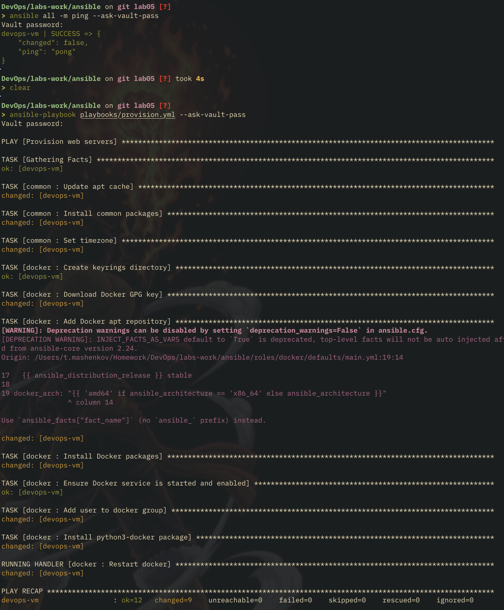
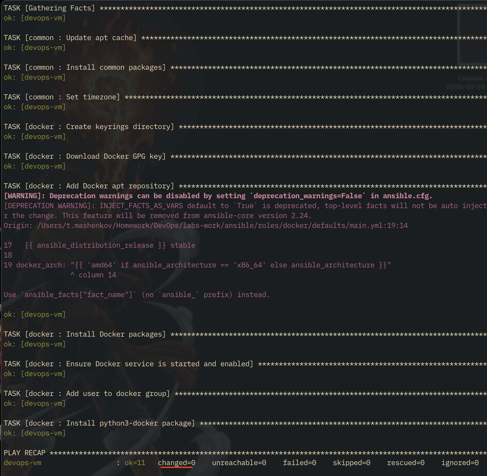
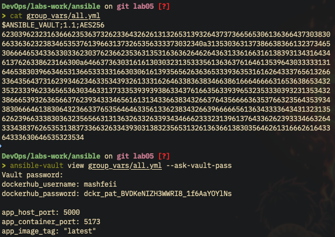
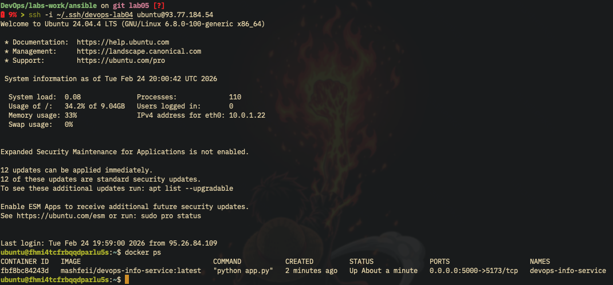
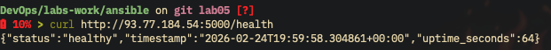
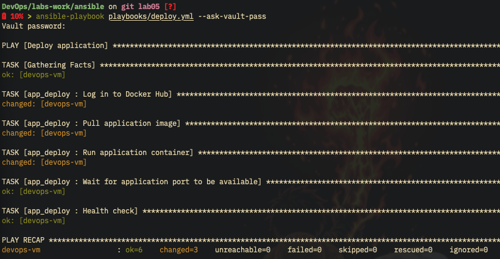
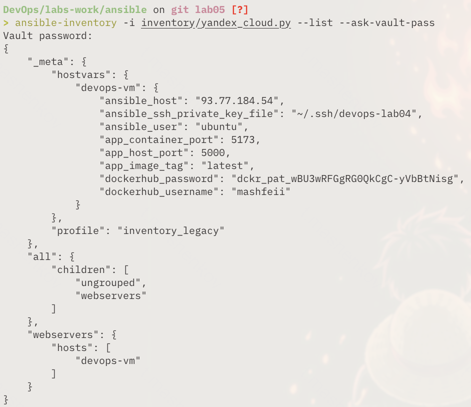
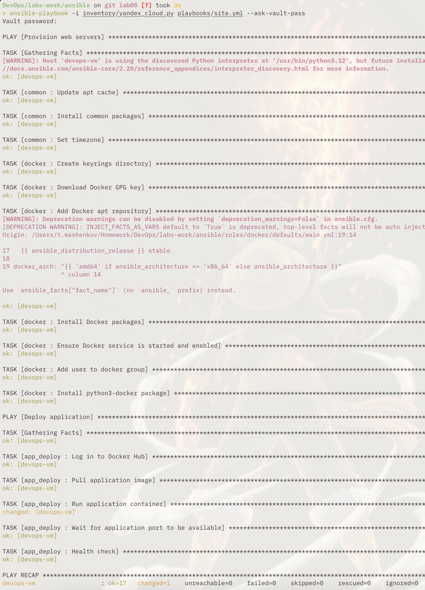

# Lab 05 - Ansible Fundamentals

## Overview

- Automating VM provisioning and application deployment using Ansible
- Building role-based configuration with common, Docker, and app deployment roles
- Implementing idempotent playbooks for repeatable infrastructure management
- Using Ansible Vault for secure credential management
- Bonus: Dynamic inventory with Yandex Cloud plugin

## Architecture Overview

### Tool Versions

| Tool              | Version                             |
| ----------------- | ----------------------------------- |
| Ansible           | 2.16+                               |
| Target OS         | Ubuntu 24.04 LTS                    |
| Docker CE         | Latest                              |
| Python (target)   | 3.x                                 |
| Application Image | mashfeii/devops-info-service:latest |

### Role Structure

```
labs-work/ansible/
├── ansible.cfg
├── inventory/
│   ├── hosts.ini                  # Static inventory (fill in VM IP)
│   ├── yandex_cloud.py           # Bonus: dynamic inventory script
│   └── group_vars/
│       └── all.yml                # Vault-encrypted credentials
├── roles/
│   ├── common/                    # System packages and timezone
│   │   ├── tasks/main.yml
│   │   └── defaults/main.yml
│   ├── docker/                    # Docker CE installation
│   │   ├── tasks/main.yml
│   │   ├── handlers/main.yml
│   │   └── defaults/main.yml
│   └── app_deploy/                # Container deployment
│       ├── tasks/main.yml
│       ├── handlers/main.yml
│       └── defaults/main.yml
├── playbooks/
│   ├── site.yml                   # Full pipeline (provision + deploy)
│   ├── provision.yml              # System setup (common + docker)
│   └── deploy.yml                 # App deployment only
└── docs/
    └── LAB05.md
```

### Network Architecture

```
User -> http://<VM_IP>:5000 -> Docker (host:5000 -> container:5173) -> Flask App
```

The host port 5000 is mapped to container port 5173 (Flask app's listening port). Port 5000 is already allowed in the Yandex Cloud security group from Lab 04.

## Roles Documentation

### Common Role

**Purpose:** Prepare the base system with essential packages and correct timezone

**Variables:**

| Variable          | Default | Description                |
| ----------------- | ------- | -------------------------- |
| `common_packages` | list    | System packages to install |
| `common_timezone` | `UTC`   | Server timezone            |

**Tasks:**

1. Update apt cache (skips if updated within last hour via `cache_valid_time: 3600`)
2. Install common packages (`state: present` - idempotent, no reinstall if present)
3. Set timezone using `community.general.timezone`

**Idempotency:** The `cache_valid_time` parameter avoids redundant apt updates. Package installation with `state: present` is a no-op when packages are already installed.

### Docker Role

**Purpose:** Install Docker CE from official repository using modern GPG key management

**Variables:**

| Variable              | Default                        | Description                 |
| --------------------- | ------------------------------ | --------------------------- |
| `docker_user`         | `ubuntu`                       | User added to docker group  |
| `docker_packages`     | list                           | Docker packages to install  |
| `docker_gpg_url`      | Docker official URL            | GPG key download URL        |
| `docker_gpg_key_path` | `/etc/apt/keyrings/docker.asc` | GPG key storage path        |
| `docker_arch`         | auto-detected                  | System architecture mapping |

**Tasks:**

1. Create `/etc/apt/keyrings` directory
2. Download Docker GPG key via `get_url` (not deprecated `apt_key`)
3. Add Docker apt repository with `signed-by` parameter
4. Install Docker packages
5. Ensure Docker service is started and enabled
6. Add user to docker group
7. Install `python3-docker` via apt (required for `community.docker` modules, installed via apt to comply with Ubuntu 24.04 PEP 668 externally-managed restriction)

**Handler:** Restart docker - triggered when Docker packages are installed or updated

**Dependencies:** Common role (for `ca-certificates`, `gnupg`, `curl`)

### App Deploy Role

**Purpose:** Pull and run the Flask application as a Docker container with health verification

**Variables:**

| Variable             | Default                        | Description                 |
| -------------------- | ------------------------------ | --------------------------- |
| `app_host_port`      | `5000`                         | Port exposed on the host    |
| `app_container_port` | `5173`                         | Flask app port in container |
| `app_image`          | `mashfeii/devops-info-service` | Docker image name           |
| `app_image_tag`      | `latest`                       | Image tag                   |
| `app_container_name` | `devops-info-service`          | Container name              |
| `app_restart_policy` | `unless-stopped`               | Docker restart policy       |

**Tasks:**

1. Log in to Docker Hub (`no_log: true` to hide credentials)
2. Pull application image (`force_source: true` to always check for updates)
3. Run container with port mapping `5000:5173` and restart policy
4. Wait for port 5000 to be available
5. Health check at `/health` endpoint with retries

**Handler:** Restart app container - can be triggered by configuration changes

**Dependencies:** Docker role (Docker must be installed and running)

## Idempotency Demonstration

### First Run



### Second Run (Idempotency Proof)



Key indicators of idempotency:

- `cache_valid_time: 3600` prevents repeated apt updates
- `state: present` does not reinstall existing packages
- Docker GPG key download is skipped if file exists with correct mode
- Docker service enable/start is a no-op when already running

## Ansible Vault Usage

### Encryption Process

The `group_vars/all.yml` file contains Docker Hub credentials and is encrypted with Ansible Vault before committing.

```bash
cd labs-work/ansible
ansible-vault encrypt inventory/group_vars/all.yml
```

### Encryption Evidence



### Using Vault in Playbooks

Playbooks that need vault variables are run with `--ask-vault-pass`:

```bash
ansible-playbook playbooks/deploy.yml --ask-vault-pass
```

## Deployment Verification

### Running Containers



### Health Check



### Deploy Playbook Output



## Key Decisions

### Why Role-Based Structure Instead of a Single Playbook

Roles provide logical separation of concerns: system preparation (common), container runtime (docker), and application deployment (app_deploy). Each role can be developed, tested, and reused independently. The provision and deploy playbooks compose these roles differently, allowing infrastructure setup without redeploying the app, or redeploying without reprovisioning. This mirrors real-world separation where different teams may own different layers.

### Why `python3-docker` via apt Instead of pip

Ubuntu 24.04 enforces PEP 668, marking the system Python as "externally managed." Running `pip install docker` outside a virtual environment fails with an error. Since Ansible runs system-wide (not in a venv), the `python3-docker` apt package is the correct way to provide the Python Docker SDK. This avoids `--break-system-packages` hacks and keeps the system package manager as the single source of truth for system-level dependencies.

### Why `get_url` Instead of `apt_key` for Docker GPG Key

The `apt_key` module is deprecated in Ansible because the underlying `apt-key` command is deprecated in modern Debian/Ubuntu. The modern approach stores GPG keys in `/etc/apt/keyrings/` and references them via the `signed-by` parameter in the repository definition. This is more secure (per-repository key scope) and future-proof.

### Why Host Port 5000 Maps to Container Port 5173

The Flask application inside the container listens on port 5173 (as configured in Lab 01). The Yandex Cloud security group from Lab 04 already allows ingress on port 5000. Rather than modifying the security group or the application's internal port, the Docker port mapping bridges the two: external traffic arrives on 5000 and is forwarded to 5173 inside the container.

### Why `force_source: true` on Image Pull

Without `force_source`, the `docker_image` module skips pulling if an image with the same name:tag exists locally. Since we use the `latest` tag, the local image could be stale. `force_source: true` ensures every deployment checks Docker Hub for a newer version of the image, guaranteeing the most recent build is always deployed.

## Bonus: Dynamic Inventory

### Script-Based Approach

There is no official `yandex.cloud` Ansible Galaxy collection, so the dynamic inventory uses a Python script (`inventory/yandex_cloud.py`) that calls the `yc` CLI directly.

**Prerequisites:**

1. `yc` CLI installed and authenticated (`yc init`)
2. Set `YC_FOLDER_ID` environment variable: `export YC_FOLDER_ID="your-folder-id"`
3. Authenticate: `export YC_TOKEN=$(yc iam create-token)`

**How it works:**

- Calls `yc compute instance list` to discover VMs
- Filters for `RUNNING` instances only
- Extracts the NAT IP address as `ansible_host`
- Groups VMs by their `project` label (VMs labeled `project=devops-course` go into the `webservers` group)
- Uses VM name as the hostname
- Supports the standard `--list` and `--host` Ansible inventory interface

### Usage

```bash
# Set required env vars
export YC_FOLDER_ID="your-folder-id"
export YC_TOKEN=$(yc iam create-token)

# List discovered hosts
ansible-inventory -i inventory/yandex_cloud.py --list

# Use with playbooks
ansible-playbook -i inventory/yandex_cloud.py playbooks/site.yml --ask-vault-pass
```




## Challenges and Solutions

### Challenge 1: PEP 668 Blocking pip Install on Ubuntu 24.04

**Problem:** Attempting to install the Docker Python SDK via `pip install docker` on Ubuntu 24.04 fails because the system Python is marked as "externally managed" per PEP 668
**Solution:** Used `ansible.builtin.apt` to install `python3-docker` from Ubuntu's package repository instead of pip, which provides the same Docker SDK without violating the externally-managed environment restriction

### Challenge 2: Docker GPG Key Management

**Problem:** The traditional `apt_key` approach is deprecated and Ansible's `apt_key` module shows deprecation warnings
**Solution:** Downloaded the GPG key to `/etc/apt/keyrings/docker.asc` using `get_url` and referenced it via the `signed-by` parameter in the apt repository definition, following Docker's own installation documentation for modern Ubuntu

### Challenge 3: Ensuring Idempotent Apt Cache Updates

**Problem:** Running `apt update` on every playbook execution wastes time and bandwidth, especially during development with frequent re-runs
**Solution:** Used `cache_valid_time: 3600` parameter on the apt module, which only refreshes the cache if the last update was more than one hour ago, making repeated runs fast without risking stale package lists
