# Lab 06 - Advanced Ansible: Blocks, Tags, Docker Compose & CI/CD

## Overview

- Refactored roles with blocks (error handling) and tags (selective execution)
- Migrated from `docker_container` to Docker Compose with Jinja2 templates
- Added wipe logic for clean app removal and redeployment
- Created CI/CD pipeline with GitHub Actions for linting and deployment
- Bonus: multi-app deployment for Python and Go services

## Architecture Overview

### Tool Versions

| Tool             | Version                                |
| ---------------- | -------------------------------------- |
| Ansible          | 2.16+                                  |
| Docker Compose   | v2 (plugin)                            |
| Target OS        | Ubuntu 24.04 LTS                       |
| Python App Image | mashfeii/devops-info-service:latest    |
| Go App Image     | mashfeii/devops-info-service-go:latest |

### Role Structure

```
labs-work/ansible/
├── ansible.cfg
├── inventory/
│   ├── hosts.ini
│   └── group_vars/
│       └── all.yml                    # Vault-encrypted credentials
├── vars/
│   ├── app_python.yml                 # Python app variables
│   └── app_bonus.yml                  # Go app variables (bonus)
├── roles/
│   ├── common/                        # System packages with blocks+tags
│   │   ├── tasks/main.yml
│   │   └── defaults/main.yml
│   ├── docker/                        # Docker CE with blocks+tags
│   │   ├── tasks/main.yml
│   │   ├── handlers/main.yml
│   │   └── defaults/main.yml
│   └── web_app/                       # Docker Compose deployment
│       ├── tasks/main.yml
│       ├── tasks/wipe.yml
│       ├── handlers/main.yml
│       ├── defaults/main.yml
│       ├── meta/main.yml              # Docker role dependency
│       └── templates/
│           └── docker-compose.yml.j2
├── playbooks/
│   ├── site.yml                       # Full pipeline
│   ├── provision.yml                  # System setup
│   ├── deploy.yml                     # Default app deployment
│   ├── deploy_python.yml              # Python-specific deployment
│   ├── deploy_bonus.yml               # Go app deployment (bonus)
│   └── deploy_all.yml                 # Deploy both apps
└── docs/
    └── LAB06.md
```

## Blocks and Error Handling

Blocks group related tasks and add error handling with `rescue` (runs on failure) and `always` (runs regardless) sections.

### Common Role

Two blocks:

**packages** (`tags: packages, common`) - apt cache update, package install, timezone setup

- Rescue: retries apt update, then retries packages
- Always: writes log to `/tmp/ansible-common-complete.log`

**users** (`tags: users, common`) - verifies primary system user exists

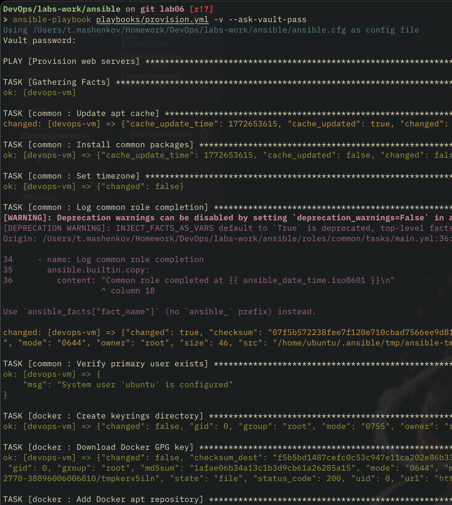

### Docker Role

Two blocks:

**docker_install** (`tags: docker_install, docker`) - GPG key, apt repo, package install

- Rescue: pauses 10s, retries apt update and install
- Always: ensures Docker service is running and enabled

**docker_config** (`tags: docker_config, docker`) - adds user to docker group, installs python3-docker

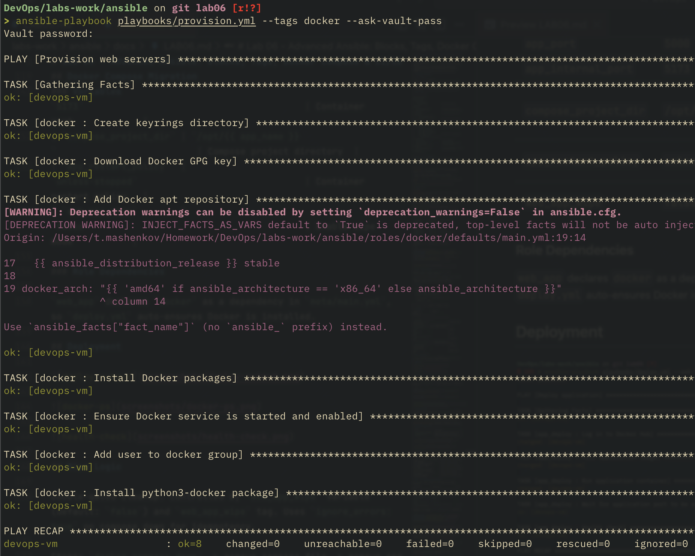

## Tags

| Tag              | Scope        | Description                       |
| ---------------- | ------------ | --------------------------------- |
| `packages`       | common role  | System package installation       |
| `users`          | common role  | User management                   |
| `common`         | common role  | All common role tasks             |
| `docker_install` | docker role  | Docker CE installation            |
| `docker_config`  | docker role  | Docker post-install configuration |
| `docker`         | docker role  | All docker role tasks             |
| `app_deploy`     | web_app role | Application deployment            |
| `compose`        | web_app role | Docker Compose operations         |
| `web_app_wipe`   | web_app role | Application removal               |

```bash
# Selective execution examples
ansible-playbook playbooks/provision.yml --tags packages
ansible-playbook playbooks/provision.yml --tags docker_install
ansible-playbook playbooks/deploy.yml --tags app_deploy --ask-vault-pass
ansible-playbook playbooks/deploy.yml -e "web_app_wipe=true" --tags web_app_wipe --ask-vault-pass
ansible-playbook playbooks/deploy.yml --list-tags
```

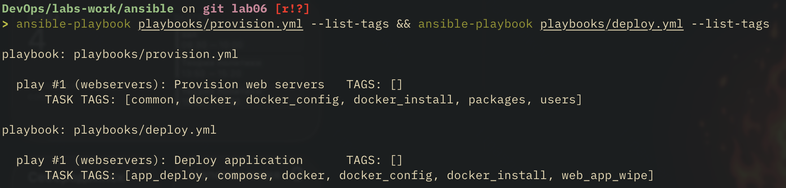
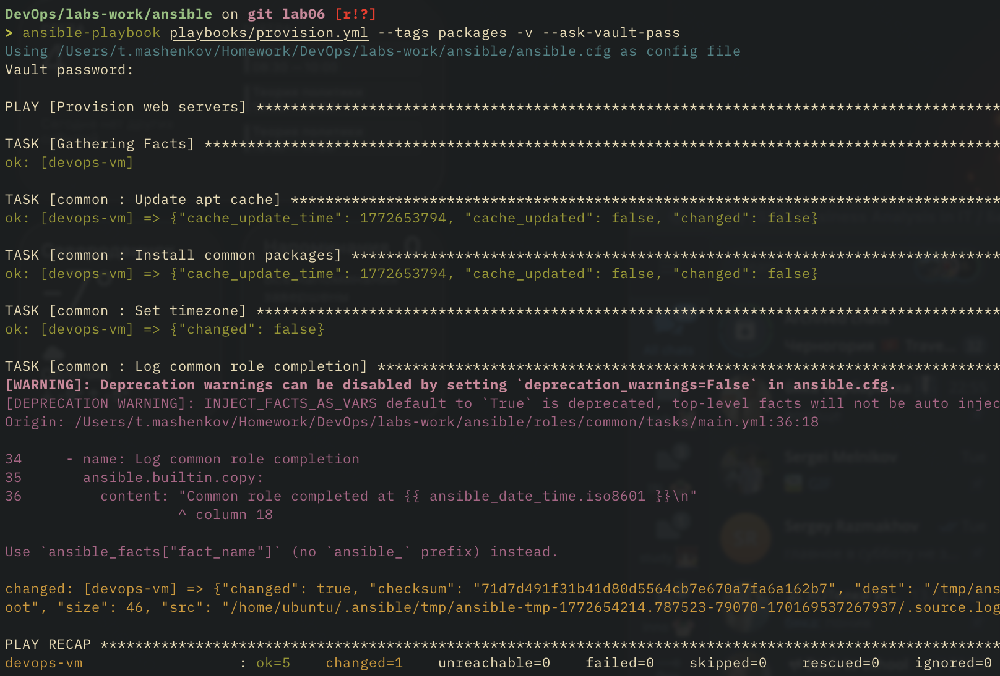

## Docker Compose Migration

Replaced `community.docker.docker_container` with `docker_compose_v2` module. Benefits:

- Declarative service definitions via templated `docker-compose.yml`
- Built-in `docker compose down` for clean removal
- Reusable template across multiple apps (bonus task)

### Template

```yaml
services:
  {{ app_name }}:
    image: {{ docker_image }}:{{ docker_tag }}
    container_name: {{ app_name }}
    restart: {{ app_restart_policy }}
    ports:
      - "{{ app_port }}:{{ app_internal_port }}"
    labels:
      managed-by: ansible
```

No `version:` key - obsolete in Compose v2 spec.

### Variables

| Variable              | Default Value                                  | Description                |
| --------------------- | ---------------------------------------------- | -------------------------- |
| `app_name`            | `devops-info-service`                          | Container and service name |
| `docker_image`        | `{{ dockerhub_username }}/devops-info-service` | Docker image reference     |
| `docker_tag`          | `latest`                                       | Image tag                  |
| `app_port`            | `5000`                                         | Host port                  |
| `app_internal_port`   | `5173`                                         | Container port             |
| `compose_project_dir` | `/opt/{{ app_name }}`                          | Compose project directory  |
| `app_restart_policy`  | `unless-stopped`                               | Container restart policy   |
| `web_app_wipe`        | `false`                                        | Enable wipe mode           |

### Role Dependencies

`web_app` declares `docker` as a dependency in `meta/main.yml`, so `deploy.yml` auto-ensures Docker is installed.

## Deployment

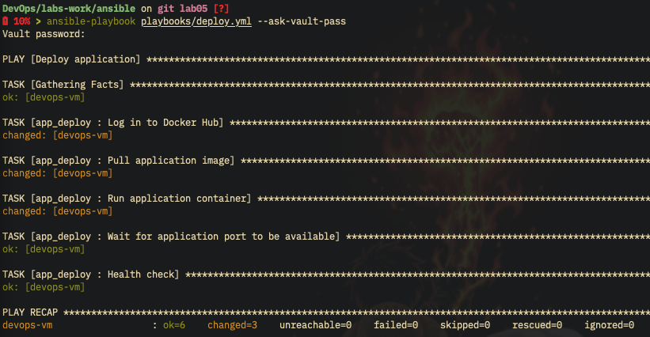

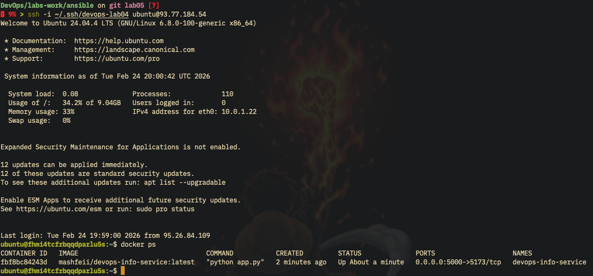

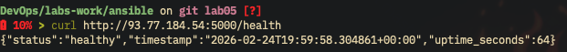

## Wipe Logic

Double-gated cleanup: controlled by `web_app_wipe` variable (default: `false`) and `web_app_wipe` tag. Uses `ignore_errors: true` on compose down for idempotency.

Steps: `docker compose down` -> remove compose file -> remove app directory.

```bash
# Wipe only
ansible-playbook playbooks/deploy.yml -e "web_app_wipe=true" --tags web_app_wipe --ask-vault-pass

# Clean reinstall (wipe + deploy)
ansible-playbook playbooks/deploy.yml -e "web_app_wipe=true" --ask-vault-pass
```

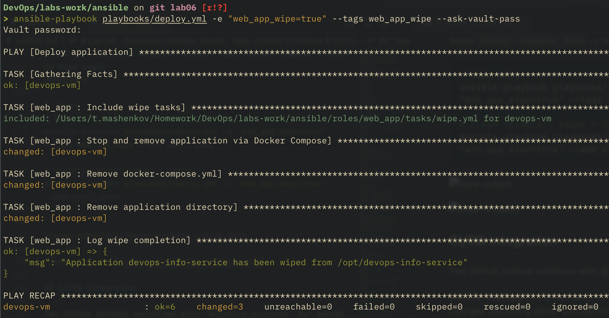

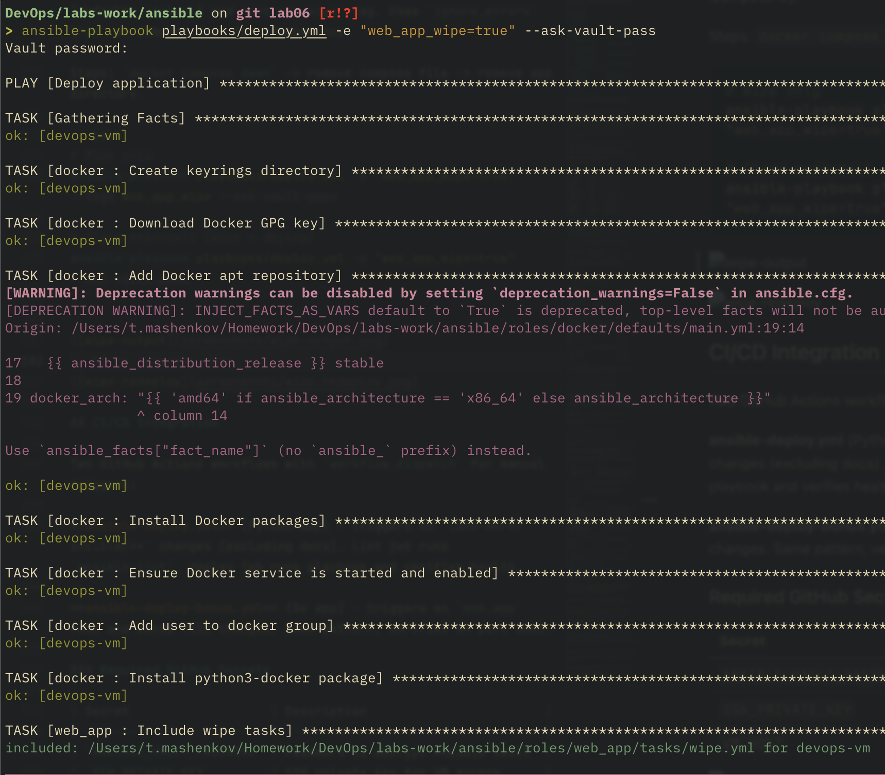
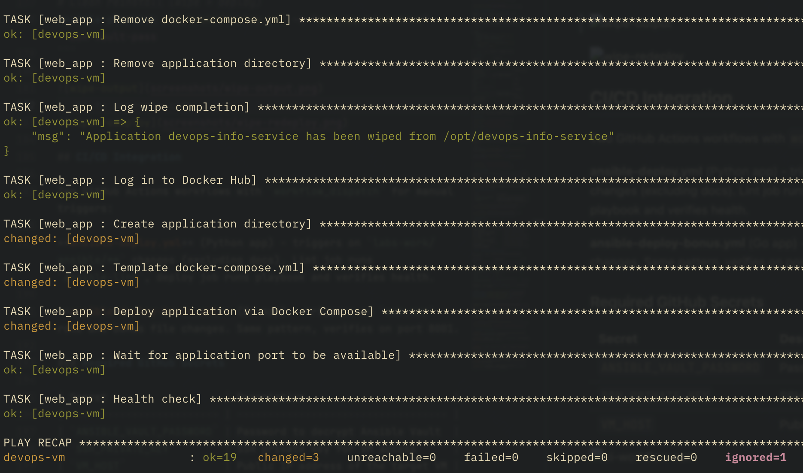

## CI/CD Integration

Two GitHub Actions workflows with `workflow_dispatch` for manual triggers:

**ansible-deploy.yml** (Python app) - triggers on `labs-work/ansible/**` changes (excluding docs). Lint job runs `ansible-lint`, deploy job runs playbook and verifies health.

**ansible-deploy-bonus.yml** (Go app) - triggers on `web_app` role and bonus file changes. Same pattern, verifies on port 8001.

### Required GitHub Secrets

| Secret                   | Description                        |
| ------------------------ | ---------------------------------- |
| `ANSIBLE_VAULT_PASSWORD` | Password to decrypt Ansible Vault  |
| `SSH_PRIVATE_KEY`        | SSH private key for VM access      |
| `VM_HOST`                | Public IP address of the target VM |

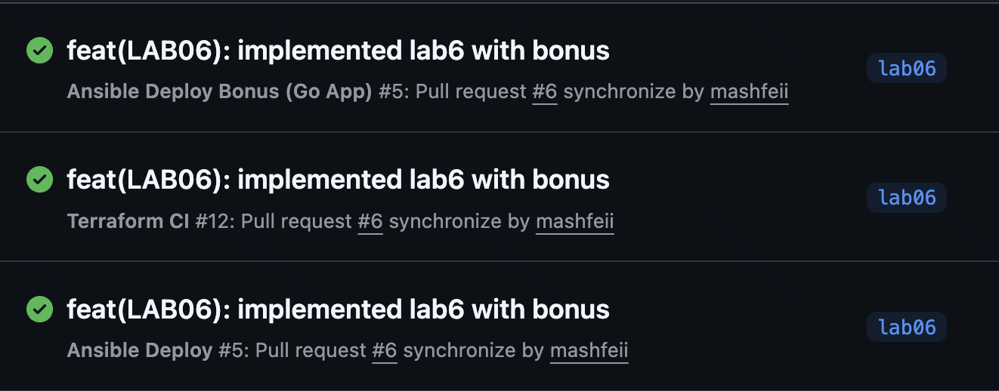

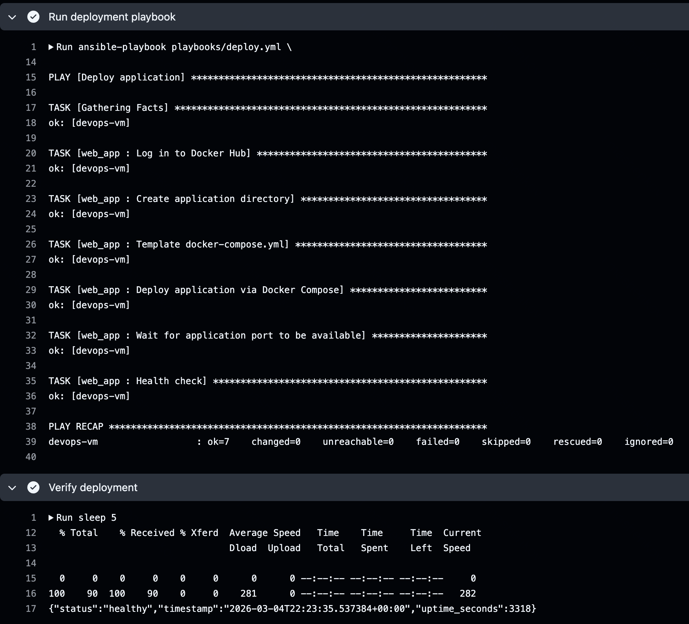

## Key Decisions

| Decision                         | Rationale                                            |
| -------------------------------- | ---------------------------------------------------- |
| Rename `app_deploy` to `web_app` | Reflects Docker Compose web service pattern          |
| Port 5000:5173 preserved         | Matches existing Yandex Cloud security group rules   |
| Go app on port 8001              | Avoids conflict with Python app on 5000              |
| `include_tasks` for wipe         | Allows tag filtering without running wipe by default |
| `pull: always` in compose        | Ensures latest image on every deploy                 |
| Role meta dependency             | No need to list docker role in deploy playbooks      |

## Bonus: Multi-Application Deployment

The `web_app` role is reused for both apps by overriding variables:

| Variable              | Python App                     | Go App                            |
| --------------------- | ------------------------------ | --------------------------------- |
| `app_name`            | `devops-info-service`          | `devops-info-service-go`          |
| `docker_image`        | `mashfeii/devops-info-service` | `mashfeii/devops-info-service-go` |
| `app_port`            | `5000`                         | `8001`                            |
| `app_internal_port`   | `5173`                         | `8080`                            |
| `compose_project_dir` | `/opt/devops-info-service`     | `/opt/devops-info-service-go`     |

Playbooks: `deploy_python.yml`, `deploy_bonus.yml` (individual), `deploy_all.yml` (both).

```bash
ansible-playbook playbooks/deploy_python.yml --ask-vault-pass
ansible-playbook playbooks/deploy_bonus.yml --ask-vault-pass
ansible-playbook playbooks/deploy_all.yml --ask-vault-pass
ansible-playbook playbooks/deploy_bonus.yml -e "web_app_wipe=true" --tags web_app_wipe --ask-vault-pass
```

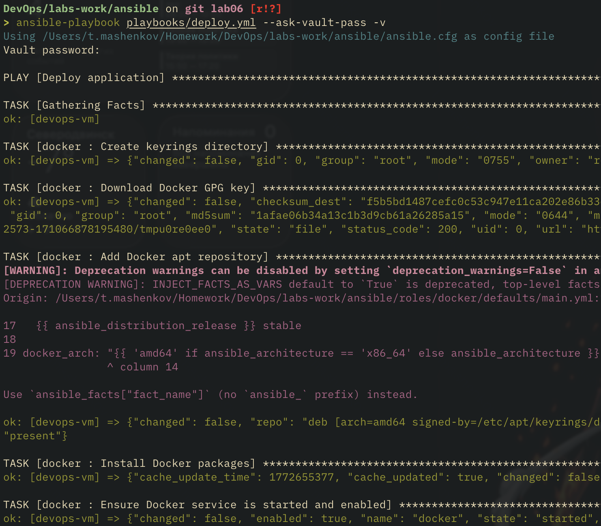
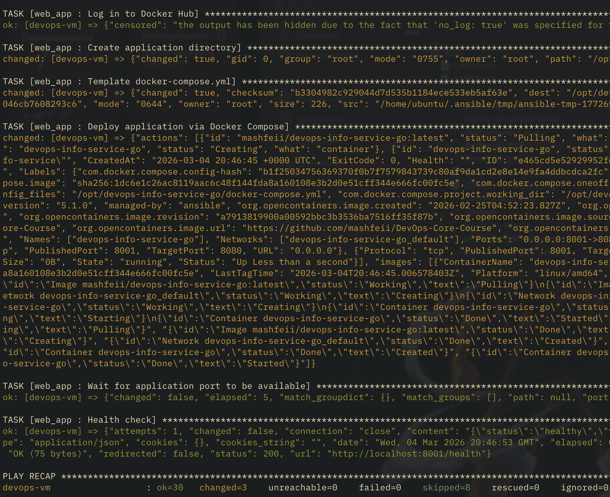

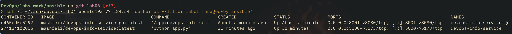

VM IP changed since i forgot to open 8001 port and needed to re-apply terraform ^^
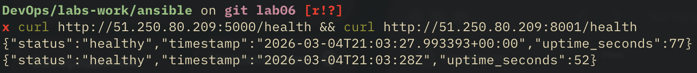

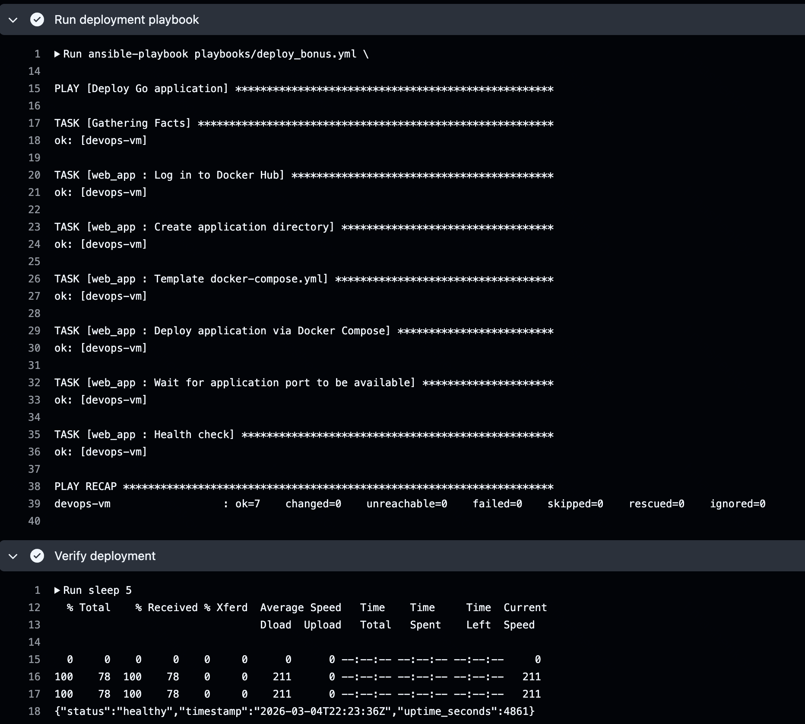

## Challenges and Solutions

**Problem:** `include_tasks` with tags needs tags on both the include statement and the included file

**Solution:** Added `apply: tags` on `include_tasks` and matching tags on the block inside `wipe.yml`

---

**Problem:** `docker compose down` fails if compose file doesn't exist yet

**Solution:** `ignore_errors: true` on compose down task for idempotent wipe

---

**Problem:** Role meta dependencies run docker role even with only wipe tags selected

**Solution:** Acceptable - Docker must be present for `docker compose down`, and the role is idempotent
