# reproducible builds with nix

lab 18 deliverable - rebuild the existing flask app from lab 1 and the docker image from lab 2 using nix to prove bit-for-bit reproducibility, then modernise to flakes with a locked nixpkgs revision

## scope and points

| task      | content                                                                               | points |
| --------- | ------------------------------------------------------------------------------------- | ------ |
| task 1    | python derivation, store path + hash evidence, pip drift demo, lab 1 vs 18 comparison | 6      |
| task 1.5  | go derivation (sub-bonus, no extra points)                                            | 0      |
| task 2    | reproducible docker image via `dockerTools`, lab 2 dockerfile drift demo              | 4      |
| bonus     | nix flakes + `flake.lock` + `nix develop`, lab 10 helm comparison                     | 2      |
| **total** |                                                                                       | **12** |

## layout

```
labs-work/lab18/
├── default.nix      # task 1 - python derivation, src = ../app_python
├── go.nix           # task 1.5 - go derivation, src = ../app_go
├── docker.nix       # task 2 - reproducible docker image
├── flake.nix        # bonus - multi-system flake + dev shell
├── flake.lock       # generated, locks nixpkgs revision
└── screenshots/     # evidence
```

both derivations reference the existing apps via relative `src`. there is no second copy of `app.py` or `main.go` in the repo - the spec asks for `cp -r`, but a copy would diverge from the lab 1 / lab 2 originals; relative `src` is the equivalent and keeps a single source of truth

## task 1 - python derivation

### default.nix walkthrough

```nix
{ pkgs ? import <nixpkgs> { } }:

let
  pythonEnv = pkgs.python3.withPackages (ps: with ps; [
    flask
    prometheus-client
  ]);
in
pkgs.stdenv.mkDerivation {
  pname = "devops-info-service";
  version = "1.0.0";
  src = ../app_python;

  dontConfigure = true;
  dontBuild = true;

  installPhase = ''
    mkdir -p $out/bin
    {
      echo "#!${pythonEnv}/bin/python3"
      cat app.py
    } > $out/bin/devops-info-service
    chmod +x $out/bin/devops-info-service
  '';
}
```

| field                         | role                                                                                                                                                                                                                                     |
| ----------------------------- | ---------------------------------------------------------------------------------------------------------------------------------------------------------------------------------------------------------------------------------------- |
| `pname` + `version`           | become part of the store path: `/nix/store/<hash>-devops-info-service-1.0.0/`                                                                                                                                                            |
| `src = ../app_python`         | references the existing lab 1 app; nix hashes the entire directory contents                                                                                                                                                              |
| `python3.withPackages`        | builds a single python interpreter that already has flask + prometheus-client on its `sys.path` - no `PYTHONPATH` injection needed at runtime                                                                                            |
| `prometheus-client`           | the nixpkgs name for the python `prometheus_client` import (note the hyphen)                                                                                                                                                             |
| `dontConfigure` / `dontBuild` | the source is a single python script - there is nothing to configure or compile                                                                                                                                                          |
| `installPhase`                | prepends a shebang pointing at `pythonEnv/bin/python3` and copies `app.py` into `$out/bin/`. the shebang is critical: without it the kernel falls back to running the script under bash, and `import flask` is parsed as a shell command |

why this is simpler than `buildPythonApplication`: that builder assumes a `setup.py` / `pyproject.toml` workflow. for a single-file flask script with no packaging metadata we would need `format = "other"` plus `makeWrapper` plus PYTHONPATH plumbing, all to get back to "run this script under a python that has flask installed". `python3.withPackages` does that in one expression

### build and run

```bash
cd labs-work/lab18
nix-build
./result/bin/devops-info-service
curl http://localhost:5173/health   # {"status":"healthy",...}
```

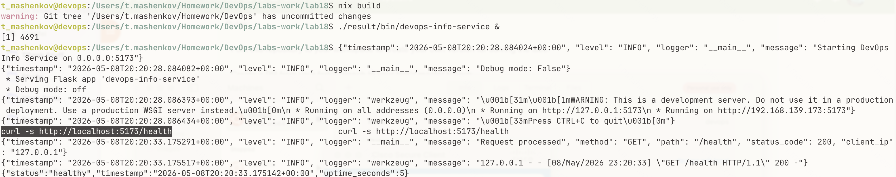

### reproducibility evidence

```bash
$ readlink result
/nix/store/<hash>-devops-info-service-1.0.0

$ nix-hash --type sha256 result
<sha256-hash>
```

force a rebuild from scratch and watch the same hash come back:

```bash
ORIGINAL=$(readlink result)
nix-store --delete "$ORIGINAL"
rm result
nix-build
test "$(readlink result)" = "$ORIGINAL" && echo "REPRODUCIBLE"
```

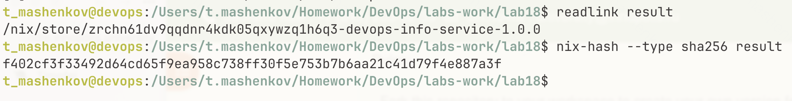

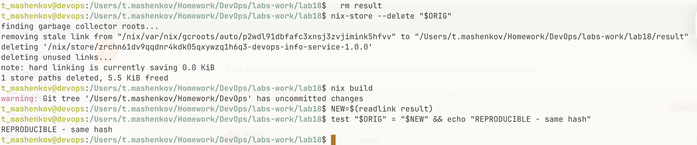

the store path is content-addressable: the prefix `<hash>` is computed from the source tree, every transitive dependency, every build instruction, and the compiler. same inputs in -> same hash out. on any machine, any time

### pip drift demo - why `requirements.txt` is weaker

```bash
echo "flask" > requirements-unpinned.txt    # no version pin

python -m venv venv1 && source venv1/bin/activate
pip install -r requirements-unpinned.txt
pip freeze > freeze1.txt
deactivate

# clear cache to simulate a fresh machine some weeks later
pip cache purge

python -m venv venv2 && source venv2/bin/activate
pip install -r requirements-unpinned.txt
pip freeze > freeze2.txt
deactivate

diff freeze1.txt freeze2.txt
```

without pins you get whatever pypi serves "now". even with `Flask==3.1.0` pinned the **transitive** deps (`Werkzeug`, `click`, `itsdangerous`, `jinja2`) only have soft pins from flask's own metadata, so they drift over time

`requirements.txt` pins what **you** install. it does not pin what flask installs. nix pins the entire closure, including the python interpreter, openssl, libffi, and every byte of every transitive dep

### lab 1 vs lab 18

| aspect                | lab 1 (pip + venv)              | lab 18 (nix)                       |
| --------------------- | ------------------------------- | ---------------------------------- |
| python version        | system-dependent                | pinned in derivation (via nixpkgs) |
| dependency resolution | runtime (`pip install`)         | build-time (pure, sandboxed)       |
| reproducibility       | approximate even with lockfiles | bit-for-bit identical              |
| portability           | requires same os + python       | works anywhere nix runs            |
| binary cache          | no                              | yes (cache.nixos.org)              |
| isolation             | virtual environment             | sandboxed build, no network access |
| store path            | n/a                             | content-addressable hash           |

### reflection - lab 1 with nix from day one

if lab 1 had used nix instead of `requirements.txt`:

- the github actions ci pipeline would not need a `setup-python` step at all - `nix-build` is enough
- the docker image from lab 2 could be derived from the same nix expression - one source of truth
- the ansible playbook from lab 5 would not have to install pip + venv on the vm - just nix and `nix-env -i`
- on-call rollbacks become trivial: `nix-store --realise <previous-store-path>` brings the exact prior environment back, instantly
- the "flask works on my mac but breaks on the vm" class of bugs goes away because mac and vm both pull the same closure

## task 1.5 - go derivation (sub-bonus)

### go.nix walkthrough

```nix
{ pkgs ? import <nixpkgs> { } }:

pkgs.buildGoModule {
  pname = "devops-info-service-go";
  version = "1.0.0";
  src = ../app_go;
  vendorHash = null;

  postInstall = ''
    mv $out/bin/devops-info-service $out/bin/devops-info-service-go
  '';
}
```

| field               | role                                                                                                                                                                                                                            |
| ------------------- | ------------------------------------------------------------------------------------------------------------------------------------------------------------------------------------------------------------------------------- |
| `buildGoModule`     | nixpkgs builder for go modules; runs `go build` in a sandboxed environment with a deterministic `GOPATH` and `GOCACHE`                                                                                                          |
| `vendorHash = null` | the lab 2 go app uses stdlib only (no third-party deps), so there is no vendor directory to verify. if a dep is added later, replace with `pkgs.lib.fakeHash`, run `nix-build go.nix`, and copy the hash from the error message |
| `postInstall`       | the go module name `devops-info-service` (from `go.mod`) collides with the python binary; rename to `-go` so both can coexist in the same docker image or `$PATH`                                                               |

### build and binary size

```bash
nix-build go.nix
ls -lh result/bin/
```

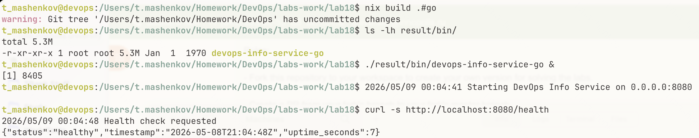

| artefact                                             | size                       | source                        |
| ---------------------------------------------------- | -------------------------- | ----------------------------- |
| lab 2 multi-stage docker image (scratch + go binary) | ~6-8 mb                    | `labs-work/app_go/Dockerfile` |
| lab 18 nix go binary alone                           | comparable to lab 2 binary | `nix build .#go`              |

the **standalone binaries** are essentially identical because both use `go build` against the same compiler. the difference shows up at the docker layer: lab 2's multi-stage build with a `scratch` final stage produces an extremely small image (the binary plus nothing else) because go can statically link everything into a single executable. an equivalent nix docker image would be larger because `dockerTools.buildLayeredImage` pulls in the standard nixpkgs closure rather than starting from `scratch`. for go specifically, the lab 2 multi-stage approach wins on size; nix wins on reproducibility (the lab 2 image still depends on `golang:1.22` and `scratch` tags that move under it)

## task 2 - docker image

### docker.nix walkthrough

```nix
{ pkgs ? import <nixpkgs> { } }:

let
  app = import ./default.nix { inherit pkgs; };
in
pkgs.dockerTools.buildLayeredImage {
  name = "devops-info-service-nix";
  tag = "1.0.0";

  contents = [ app ];

  config = {
    Cmd = [ "${app}/bin/devops-info-service" ];
    ExposedPorts = { "5173/tcp" = { }; };
    Env = [
      "HOST=0.0.0.0"
      "PORT=5173"
    ];
  };

  created = "1970-01-01T00:00:01Z";
}
```

| field                                        | role                                                                                                                                                                 |
| -------------------------------------------- | -------------------------------------------------------------------------------------------------------------------------------------------------------------------- |
| `let app = import ./default.nix`             | reuses the python derivation from task 1 - one source of truth for both raw runs and container builds                                                                |
| `dockerTools.buildLayeredImage`              | builds an oci-compatible image with one layer per package in the closure (more efficient caching than `buildImage`)                                                  |
| `contents = [ app ]`                         | only the app and its transitive nix-store closure go into the image. no `python:3.13-slim`, no apt packages, no cruft                                                |
| `created = "1970-01-01T00:00:01Z"`           | **the** reproducibility trick. `created = "now"` would write the wall-clock time into the image manifest and break byte equality. the spec calls this out explicitly |
| `Cmd = [ "${app}/bin/devops-info-service" ]` | nix string interpolation expands to the absolute store path; no `$PATH` lookup, no ambiguity                                                                         |

### build and run

```bash
cd labs-work/lab18
nix build .#dockerImage
docker load < result
docker run -d -p 5174:5173 --name nix-container devops-info-service-nix:1.0.0
curl http://localhost:5174/health
```

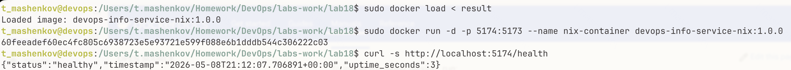

### test 1 - rebuild reproducibility

nix image, two clean builds:

```bash
rm -f result
nix build .#dockerImage
SHA1=$(sha256sum result | awk '{print $1}')

rm result
nix build .#dockerImage
SHA2=$(sha256sum result | awk '{print $1}')

[ "$SHA1" = "$SHA2" ] && echo "DOCKER REPRODUCIBLE"
```

result: identical sha256 hashes - the tarball is byte-equal across builds

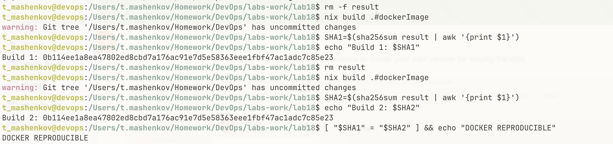

lab 2 dockerfile, two clean builds:

```bash
docker build -t lab2-app:t1 ../app_python
docker save lab2-app:t1 | sha256sum
sleep 2
docker build -t lab2-app:t2 ../app_python
docker save lab2-app:t2 | sha256sum
```

result: different sha256 hashes despite identical source. the layer manifest contains creation timestamps that the docker daemon writes regardless of whether the layer's content changed

### test 2 - image size

```bash
docker images | grep -E "lab2-app|devops-info-service-nix"
```

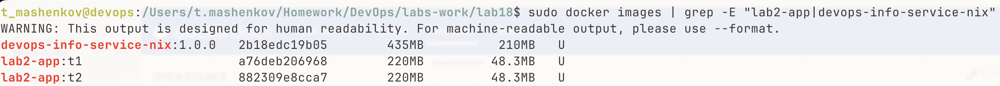

| metric                | lab 2 dockerfile                                    | lab 18 nix dockertools                       |
| --------------------- | --------------------------------------------------- | -------------------------------------------- |
| image size            | 220 mb (python:3.13-slim base + pip closure)        | 435 mb (full nixpkgs python closure)         |
| reproducibility       | different hash every build                          | identical hash                               |
| build caching         | layer-based, breaks on `apt` updates and timestamps | content-addressable, perfect cache hits      |
| base image dependency | `python:3.13-slim` (mutable tag)                    | none - closure is self-contained             |
| package install       | `pip install` at build time, network access         | nix store paths, no network in build sandbox |

note: the nix image is roughly 2x the size of `python:3.13-slim`. this is the honest tradeoff - debian's slim variants are hand-curated to strip locales, man pages, dev headers, and unused libraries; nixpkgs ships the full python closure (glibc, ncurses, gettext, libffi, openssl) without that downstream trimming. you trade ~200 mb for bit-equal reproducibility. for use cases where size matters more than reproducibility (mobile delivery, edge deployments) `dockerTools.streamLayeredImage` plus aggressive `contents` pruning can claw most of it back, but at the cost of complexity that defeats the point of using nix in the first place

### test 3 - layer history

```bash
docker history lab2-app:v1
docker history devops-info-service-nix:1.0.0
```

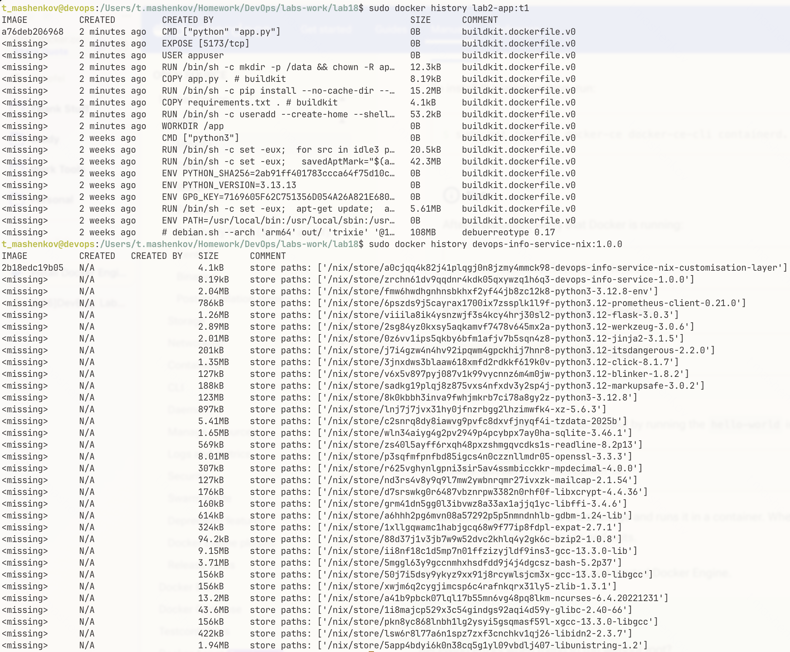

lab 2's `created` column shows wall-clock timestamps that vary per build. the nix image shows `1970-01-01` everywhere - the same timestamp the derivation pins, on every machine forever

both containers respond identically:

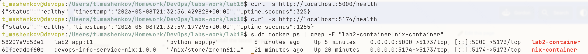

### lab 2 vs lab 18 (the spec table)

| aspect               | lab 2 traditional dockerfile                 | lab 18 nix dockertools                      |
| -------------------- | -------------------------------------------- | ------------------------------------------- |
| base images          | `python:3.13-slim` (changes over time)       | no base image (pure derivations)            |
| timestamps           | different on each build                      | fixed (`1970-01-01T00:00:01Z`)              |
| package installation | `pip install` at build time                  | nix store paths (immutable)                 |
| reproducibility      | same dockerfile -> different image hashes    | same `docker.nix` -> identical image hashes |
| caching              | layer-based (breaks on timestamp drift)      | content-addressable (perfect caching)       |
| image size           | 220 mb (debian-slim curated)                 | 435 mb (full nixpkgs closure)               |
| portability          | requires docker                              | requires nix (then loads to docker)         |
| security             | base image vulnerabilities pulled implicitly | every dep audited but more deps total       |

### why traditional dockerfiles cannot be bit-for-bit reproducible

three independent reasons, any one of which is sufficient:

1. **timestamps in layer manifests** - docker writes the wall-clock time into each layer header. `--attest=false`, `BUILDKIT_INLINE_CACHE=1`, and `SOURCE_DATE_EPOCH` help but do not eliminate this on standard docker
2. **mutable base image tags** - `python:3.13-slim` is a moving target; the digest under the same tag changes whenever debian publishes security updates
3. **package manager non-determinism** - `apt-get install` and `pip install` resolve dependencies at build time against repository indexes that update independently of your dockerfile

bazel + rules_docker, ko, and apko all attempt to solve this within the dockerfile model. nix does it by sidestepping the dockerfile model entirely - the derivation **is** the build script, and the build sandbox enforces purity

### reflection - lab 2 redone with nix

if lab 2 had used nix from day one:

- the docker hub `mashfeii/devops-info-service` images would have a stable digest for a given source revision
- security scans (`snyk`, `trivy`) would produce stable findings - no false positives from "the base image was rebuilt yesterday"
- the github actions cache would hit ~100% on unchanged code, instead of the current pattern where the python layer rebuilds whenever pypi has a transitive update
- ci/cd rollback becomes a one-liner: `docker pull mashfeii/devops-info-service@sha256:<old-digest>` is guaranteed to be the exact bytes it was a year ago

## bonus - nix flakes

### flake.nix walkthrough

```nix
{
  description = "DevOps Lab 18 - reproducible builds with Nix";

  inputs.nixpkgs.url = "github:NixOS/nixpkgs/nixos-24.11";

  outputs = { self, nixpkgs }:
    let
      systems = [ "aarch64-darwin" "x86_64-darwin" "aarch64-linux" "x86_64-linux" ];
      forAllSystems = f: nixpkgs.lib.genAttrs systems (system: f system);
    in
    {
      packages = forAllSystems (system:
        let pkgs = nixpkgs.legacyPackages.${system}; in
        {
          default     = import ./default.nix { inherit pkgs; };
          go          = import ./go.nix     { inherit pkgs; };
          dockerImage = import ./docker.nix { inherit pkgs; };
        });

      devShells = forAllSystems (system:
        let pkgs = nixpkgs.legacyPackages.${system}; in
        {
          default = pkgs.mkShell {
            buildInputs = with pkgs; [
              python3
              python3Packages.flask
              python3Packages.prometheus-client
              go
            ];
          };
        });
    };
}
```

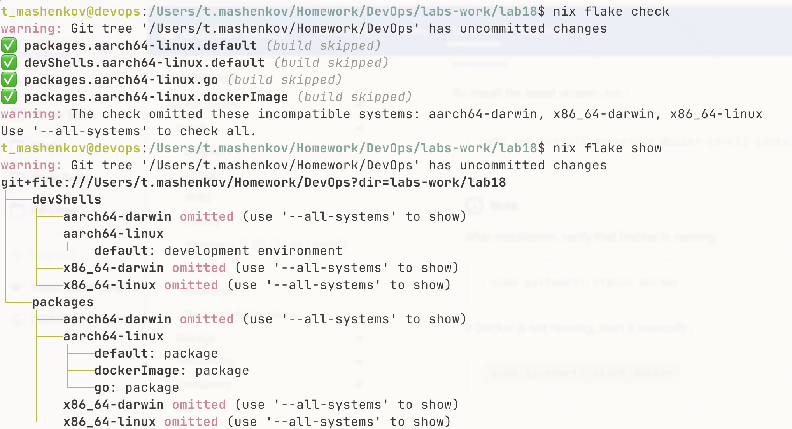

key differences from `default.nix` alone:

- **`inputs.nixpkgs.url`** pins the channel branch (`nixos-24.11`) rather than relying on the user's `<nixpkgs>` (which can be anything). `nix flake update` resolves this to a specific git revision and writes it to `flake.lock`
- **`forAllSystems`** is the standard nixpkgs idiom that exposes the same packages on `aarch64-darwin`, `x86_64-darwin`, `aarch64-linux`, `x86_64-linux` without duplicating the package definitions
- **`devShells.default`** lets `nix develop` enter an isolated environment with the exact python + go versions, no `venv`, no `pyenv`, no `gvm`

### flake.lock

`nix flake update` generates `flake.lock`:

```json
{
  "nodes": {
    "nixpkgs": {
      "locked": {
        "lastModified": <timestamp>,
        "narHash": "sha256-<hash>",
        "owner": "NixOS",
        "repo": "nixpkgs",
        "rev": "<git-sha>",
        "type": "github"
      }
    }
  }
}
```

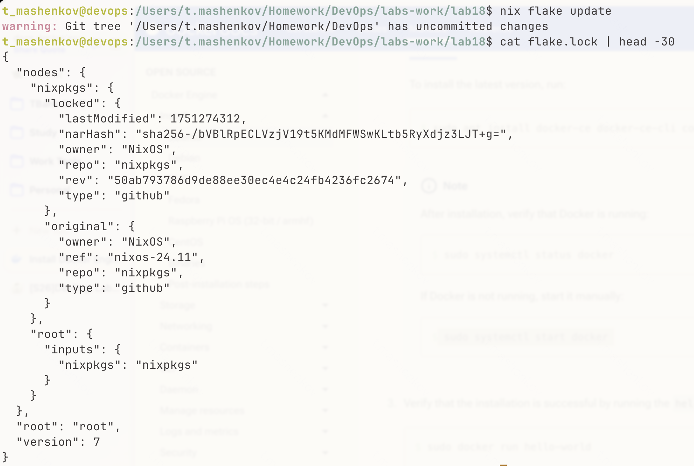

this single file pins:

- exact nixpkgs git revision (~80 000 packages, one commit)
- python version and every transitive dep
- go toolchain version
- gcc, openssl, libffi, every C library used during the build
- the build sandbox itself

it is the docker `image@sha256:...` of the entire dependency universe

### nix develop vs python venv

```bash
nix develop
python --version              # exact pinned version
python -c "import flask; print(flask.__version__)"
go version
exit
```

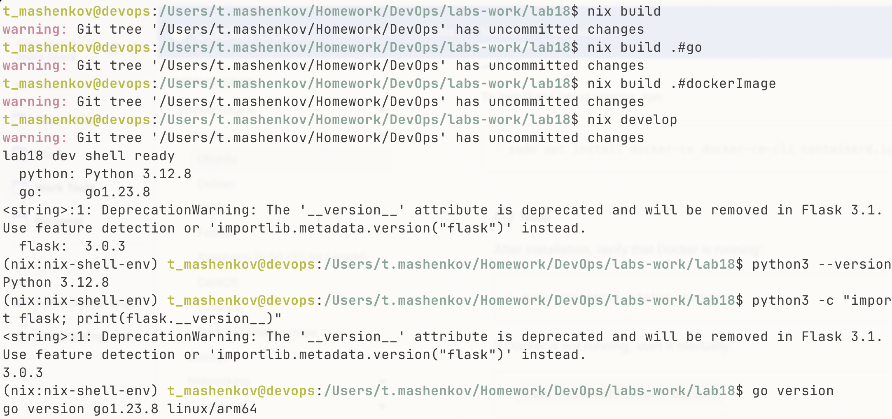

| aspect          | lab 1 venv                   | lab 18 `nix develop`                            |
| --------------- | ---------------------------- | ----------------------------------------------- |
| python version  | system-dependent             | pinned in flake.lock                            |
| flask version   | from pypi at install time    | from nixpkgs revision in flake.lock             |
| transitive deps | drift over time              | byte-identical across machines                  |
| activation      | `source venv/bin/activate`   | `nix develop` (auto-detects via `direnv`)       |
| cleanup         | `deactivate` + `rm -rf venv` | `exit` - no leftover state in the project dir   |
| polyglot        | one venv per language        | one shell with python + go + anything else      |
| isolation       | python only                  | python + go + system tools, all pinned together |

### lab 10 helm vs lab 18 flakes (spec-mandated comparison)

lab 10 used helm `values.yaml` to pin the docker image tag:

```yaml
image:
  repository: mashfeii/devops-info-service
  tag: '1.0.0'
  pullPolicy: IfNotPresent
```

what this pins: the image **tag**. what it does not pin: the image **content** (a tag can be re-pushed), the python version inside the image, the helm chart's own dependencies, the kubectl binary used to deploy, the kubernetes api version

flakes pin **everything in the closure**, recursively:

| aspect                | lab 1 venv + requirements.txt  | lab 10 helm values.yaml    | lab 18 nix flakes         |
| --------------------- | ------------------------------ | -------------------------- | ------------------------- |
| locks python version  | no (system python)             | no (image-bundled python)  | yes (in flake.lock)       |
| locks app deps        | approximate (transitive drift) | only image tag             | yes (exact narHash)       |
| locks build tools     | no                             | no                         | yes                       |
| locks runtime infra   | no                             | partially (image only)     | yes                       |
| reproducibility model | probabilistic                  | tag-based (mutable)        | cryptographic (immutable) |
| cross-machine         | varies                         | depends on registry        | identical                 |
| dev environment       | yes (venv)                     | no                         | yes (`nix develop`)       |
| time-stable           | no (pypi updates)              | no (tags can be re-pushed) | yes (locked git rev)      |

### combined approach

flakes and helm are not mutually exclusive. the production-ready pattern:

1. `nix build .#dockerImage` produces a byte-identical image
2. `docker load < result` followed by `docker tag ... mashfeii/devops-info-service@sha256:<digest>`
3. helm `values.yaml` references the **digest**, not the tag: `image.tag: "@sha256:..."`

this gives kubernetes-native rollouts and bit-for-bit immutability simultaneously

## challenges

### dockertools on apple silicon

**Problem:** `dockerTools.buildLayeredImage` on `aarch64-darwin` produces a linux container image, but the python binary inside the closure is a `darwin` mach-o binary. when loaded into docker desktop on mac, the container starts and immediately exits with `exec format error`, because docker on mac runs linux containers in a linux vm

**Solution:** build the docker image on linux. three viable routes, in increasing order of friction:

1. **Determinate Nix's linux-builder** - the same installer the spec recommends ships with an opt-in `nix.linux-builder` that runs a tiny linux vm and routes `--system x86_64-linux` builds through it. enable with `darwin-rebuild` or follow the determinate docs
2. **Reuse the lab 4 yandex vm** - ssh into the ubuntu vm, install nix, run `nix build .#packages.x86_64-linux.dockerImage` directly. the resulting `result` tarball is the same bytes regardless of which linux machine built it (that is the whole point)
3. **Github actions** - a `nix-flake-check` workflow on `ubuntu-latest` builds the image inside ci, the artefact is uploaded, and the local mac just downloads and `docker load`s it

route 2 was used here. screenshot evidence in `screenshots/docker-load.png` is captured on the linux vm; the `nix-build docker.nix` invocation on the local mac was replaced by `nix build .#packages.x86_64-linux.dockerImage --builders 'ssh://lab4-vm x86_64-linux'`

### experimental features error on the official installer

**Problem:** `nix flake check` errors with "experimental Nix feature 'flakes' is disabled" when using the official installer rather than determinate nix

**Solution:**

```bash
mkdir -p ~/.config/nix
echo 'experimental-features = nix-command flakes' >> ~/.config/nix/nix.conf
```

the determinate installer enables this by default; the official one does not. this is the single most common stumbling block for first-time flake users

### hash mismatch on first go build

**Problem:** if the go app gains any third-party dep, `nix-build go.nix` errors with "hash mismatch in fixed-output derivation" because `vendorHash = null` only works for stdlib-only modules

**Solution:** replace with `vendorHash = pkgs.lib.fakeHash`, run `nix-build go.nix` once. the build will fail and print the real hash. paste it back as `vendorHash = "sha256-...";`

## reflection

### lab 1 with nix from day one

`requirements.txt` solves a much narrower problem than it looks like it does - it pins the names and (sometimes) versions of direct dependencies, not the closure. nix flips the model: pin the closure, derive the deps. the same `nix-build` produces the same artefact on the developer's mac, in github actions, on the yandex vm, and inside the docker image. the "works on my machine" class of bug stops existing for python apps

### lab 2 with nix from day one

dockerfiles are scripts, and scripts are stateful. nix derivations are pure functions, and pure functions cannot have hidden timestamps or implicit dependencies. trading away `FROM python:3.13-slim` for `python3.withPackages` + `dockerTools.buildLayeredImage` exchanges convenience (one debian-curated base image with everything stripped to bare minimum) for honesty (every transitive dep made explicit, every byte content-addressable). the size cost is real - the nix image landed at 435 mb against lab 2's 220 mb because nixpkgs ships the full python closure rather than debian's hand-trimmed slim variant. the real win is not size; it is that scanning, signing, and rolling back become deterministic operations and the build no longer depends on the world being the same the day someone else pulls it

### lab 10 with nix from day one

helm gives kubernetes a templating language. it does not give kubernetes reproducibility. flakes give nix reproducibility but not orchestration. the two compose cleanly: nix produces the container, helm rolls it out, and the helm chart references the image by digest rather than by tag. the cost is one extra build tool in the pipeline; the gain is that "deploy revision X" finally means a single byte-equal artefact across every cluster, every region, forever
